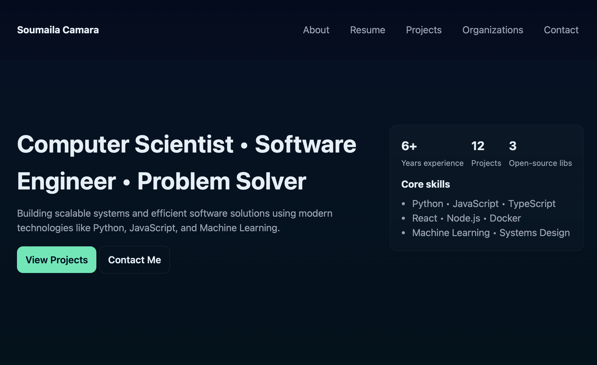

# Personal Website

This is a personal website I made using AL to display my accomplisments and other tasks I have completed.
In my CSCI class we talk about how to use a vsual studio code and to make our personal website we use a code to describe it.
The following features are implemented in the project:
- Home Page: This page showcases my name, a description of myself and has a navigation bar. There is also a surmmary about the website.
- Resume: This page showcases my work experiences, skills and education. There is also a button where users can download my resume.
- Project: This page showcases projects I have completed with descriptions.
- Organizations: This page  showcases the organizations I'm on Open Source Initiative — Contributor ACM Student Chapter — Member University Tech Club — Co-founder VSU Soccer Team - Striker/Forward

## Project Design:

Here's a mockup and design of the project:

## Notes and Comments
My experince using the AI tool was a little easy but I had a struggle in the beginning. I went though my personal website to compeleted my description page, the features implemented in the project, the project degin.
